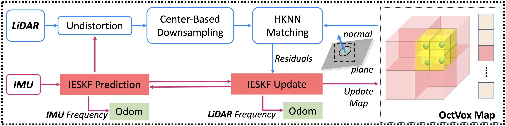
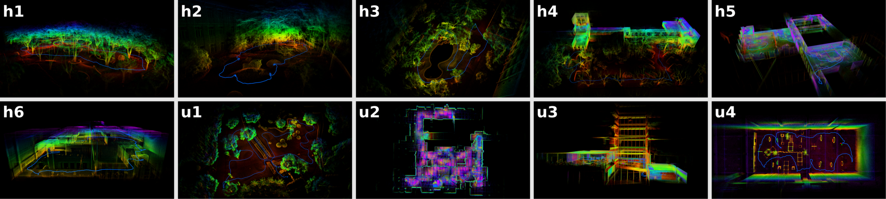

<div align="center">
  <h1>⚡Super-LIO</h1>
  <h2>Super-LIO: A Robust and Efficient LiDAR-Inertial Odometry System with a Compact Mapping Strategy</h2>
  <p><strong>This work has been accepted to <i> IEEE Robotics and Automation Letters (RA-L 2026)</i>.</strong></p>
  <br>

  [](https://github.com/Liansheng-Wang/Super-LIO.git) [](https://arxiv.org/abs/2509.05723) [](https://ieeexplore.ieee.org/document/11347459) [](https://www.bilibili.com/video/BV11wBeBYEp6) [](https://youtu.be/m9-hl8s5DDw)
</div>


<div align="center">
  <p>
    <a href="https://github.com/Liansheng-Wang/Super-LIO/tree/ros1" style="text-decoration: none;">
      
    </a>&nbsp;&nbsp;
    <a href="https://github.com/Liansheng-Wang/Super-LIO/tree/ros2" style="text-decoration: none;">
      
    </a>&nbsp;&nbsp;
    <a href="#" style="text-decoration: none; cursor: default;">
      
    </a>
  </p>
</div>

## Overview

<p align="center">
  
</p>

**Key Features:  Efficient · Robust · Cross-Platform Compatible · Supports Both ROS1/ROS2 Versions**

Super-LIO is a robust and efficient LiDAR–Inertial Odometry (LIO) system designed for real-time and large-scale autonomous navigation. It introduces a compact and structured mapping strategy that enables predictable correspondence search and stable state estimation. The system is validated through extensive real-world experiments and comparisons with state-of-the-art methods, which demonstrates that Super-LIO not only achieves **excellent accuracy** but also maintains **lower resource consumption** and realizes a nearly **1.2–4× higher real-time processing speed**⚡.


**Contributors**: [Liansheng Wang](https://github.com/Liansheng-Wang), [Xinke Zhang](https://github.com/PSQzzzxk), [Chenhui Li](https://github.com/kermitLHH), [Dongjiao He](https://github.com/Joanna-HE), [Yihan pan](https://github.com/pyh3552), Jianjun Yi.


## Quickly Run

**For ROS1 Users**: Please switch to the **ros1** branch and follow the instructions at [ros1 branch](https://github.com/Liansheng-Wang/Super-LIO/tree/ros1)

### Requirements

Ubuntu 24(22).04 · C++20 · ROS Jazzy(Humble) · Eigen · PCL 

### Dependencies

glog · TBB

```bash
sudo apt install libgoogle-glog-dev libtbb-dev
```

### Build & Run
```bash
git clone https://github.com/Liansheng-Wang/Super-LIO.git
cd Super-LIO
colcon build

source install/setup.bash
ros2 launch super_lio Livox_mid360.py

```

#### 🔁 Relocalization Mode
Super-LIO supports relocalization using a pre-built map, allowing the system to resume localization from a saved map without restarting the mapping process.
This mode is useful for long-term deployment, repeated missions, or recovery after tracking loss.

Before running relocalization, please make sure that:
- A map has been previously saved to disk.

```bash
cd PATH_2_Super-LIO
source install/setup.bash
ros2 launch super_lio relocation.py
```


## Datasets
<p align="center">
  
</p>

Super-LIO is evaluated on multiple real-world datasets covering diverse environments,
including indoor, outdoor, and large-scale scenes.

> **TODO**: Dataset download links and detailed descriptions will be provided in the future.


---

## Publications

If your like our projects, please cite us and support us with a star 🌟.
We kindly recommend to cite [our paper](https://ieeexplore.ieee.org/document/11347459) if you find this library useful:

```latex
@article{wang2026superlio,
  title   = {Super-LIO: A Robust and Efficient LiDAR-Inertial Odometry System with a Compact Mapping Strategy},
  author  = {Wang, Liansheng and Zhang, Xinke and Li, Chenhui and He, Dongjiao and Pan, Yihan and Yi, Jianjun},
  journal = {IEEE Robotics and Automation Letters},
  year    = {2026},
  volume  = {11},
  number  = {3},
  pages   = {2666--2673},
  doi     = {10.1109/LRA.2026.3653372}
}
```


## Update Logs

<details>
<summary>Click to expand <b>Update Logs</b> (click to collapse)</summary>

<br>

- 2026-01-04  
  - Separate ROS interface and algorithm.
  - Refactor SuperLIOReLoc to inherit from SuperLIO.
  - Code style aligned with ROS2 version.

- 2026-01-04
  - The main branch is renamed to ros1
  - add ros2 branch

- 2026-01-04 21:51
  - release ROS2 version

</details>